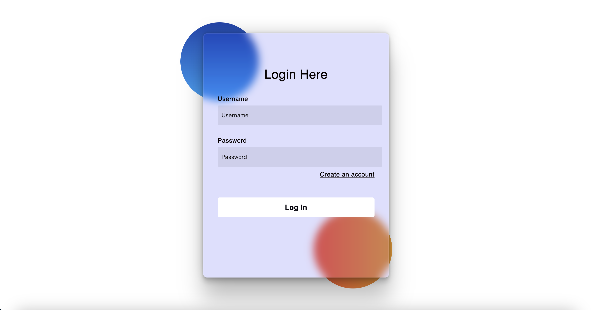
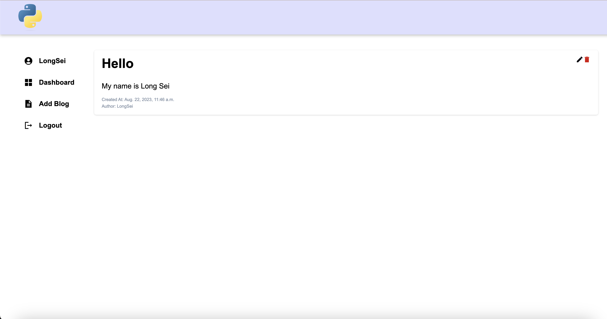
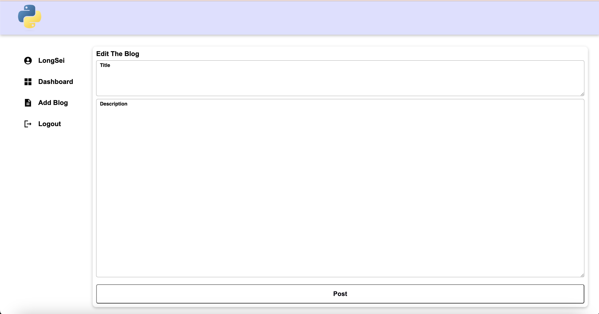

# SeiWeb

## Description
The template of blog webpage built by Django framework
* This project just created for learning purpose





## Features: 
- System Authorization (login, signup,...)
- Post text 

## Setup
The first thing to do is to clone the repository:

```sh
$ git clone https://github.com/LongSei/SeiWeb.git
```

Add the app 
```sh
python3 manage.py makemigrations dashboard 
python3 manage.py migrate dashboard
```

Create the database
```sh
python3 manage.py makemigrations
python3 manage.py migrate
```
* This database stores all your data (eg: user, post)

You can create the superuser to manage the project
```sh
python3 manage.py createsuperuser
```

Then install the dependencies:

```sh
$ pip3 install -r requirements.txt
```

And navigate to `http://127.0.0.1:8000/`

